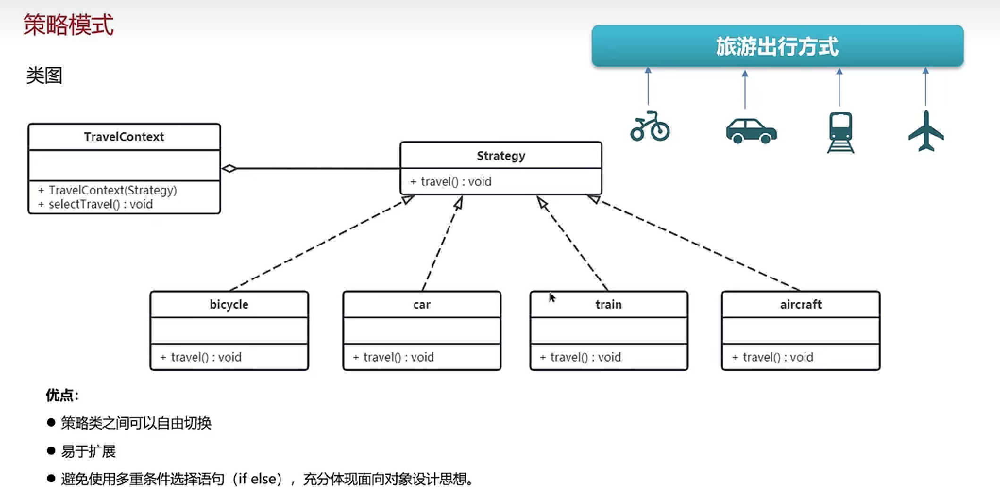
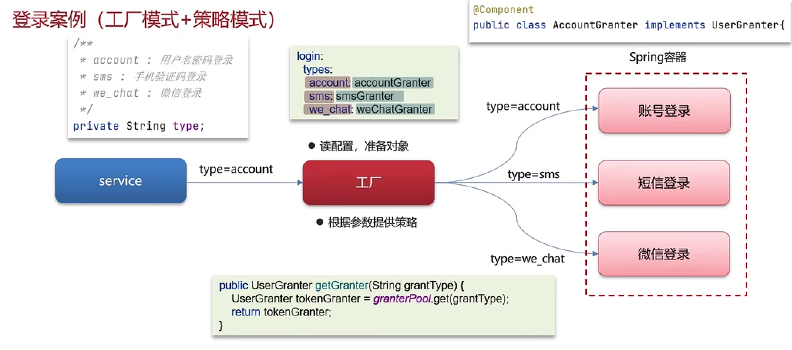

### 工厂方法
```angular2html
1. 四个角色：工厂接口，产品接口，工厂实例，产品实例
2. 每个工厂实例负责创建对于的产品，在调用中，传递具体的工厂实例，即可得到具体的产品
3. 新增一个产品的话，不需要修改原来的代码，只需要新增工厂实例和产品实例
4. 缺点：需要增加工厂实例和产品实例，代码比较复杂。
```
### 抽象工厂
```angular2html
1. 工厂的工厂。调用工厂的工厂获取不同产品的工厂，调用产品工厂中的创建不同风格的工厂方法。
```

### 策略模式


```angular2html
1. 三个角色：策略接口，具体策略实例，上下文类
2. 上下文类，通过构造函数接收策略接口的具体实例对象，并对外提供服务。调用具体策略中的方法。
```
### 工厂+策略模式实现登录


```angular2html
1. 策略模式实现不同登录的实现
2. 工厂依据type拿到具体策略实例，返回给调用者。
3. 需要增加策略的时候，还需要修改工厂类，并且有if else,麻烦。可以将策略写入配置，type:策略对象，在工厂中读取配置文件存入map
调用者传入type获取策略，增加策略只需要修改配置文件，增加具体策略实现就行，不需要修改工厂代码。
```

### 工厂+策略实现不同模型的调用
```angular2html
场景： 有不同的算法接口实例，依据不同的type调用不同的算法接口。
1. 创建算法接口工厂，将type与算法实例的对应关系写入配置中，在工厂中使用map存储type与算法接口的对应关系，依据传入的type获取对应的接口实例
新增情况：只需要修改配置文件，和新增接口实例即可，不需要修改工厂和具体业务代码。
```

### 项目中遇到那些问题？
```angular2html
1. 前端调用接口，总是没有返回结果。
 定位:使用curl判断后端是否正常。 
     在容器内使用curl命令，判断容器与服务之间网络是否相通。
     查看Nginx日志，发现连接超时，修改连接超时时间。
2. 历史对话和对话详情数据不一致问题。有些历史对话的具体对话详情没有存储下来。
   定位：方法中使用了多线程异步入库操作，同时开启了trasation注解开启事务。
        但是事务未生效，详情对话插入异常，但是对话数据正常插入，未回滚。导致数据不一致。
        检查发现，try catch 中抛异常，没有声明的抛出异常，导致事务感知异常，事务失效。
3. 如何记录历史对话信息？
    1. 将对话拆分，分为：对话，和对话详情，其中对话详情可以包含多次对话记录。当创建新的对话的时候需要将对话和具体的对话详情记录下来。
    2. 对话表，对话详情表。对话表有chatId, 详情表有messageId。
    3. 前端新建对话，chatId为空，后端将这次的对话数据加入对话表中，记录chatId,和对话title 对话详情加入对话详情表中，并给前端返回chatId
    4. 前端再次请求，携带chatId不为空，对话表不插数据，只在详情表中插入数据，通过chatId可以获取具体的对话详情信息。
```


